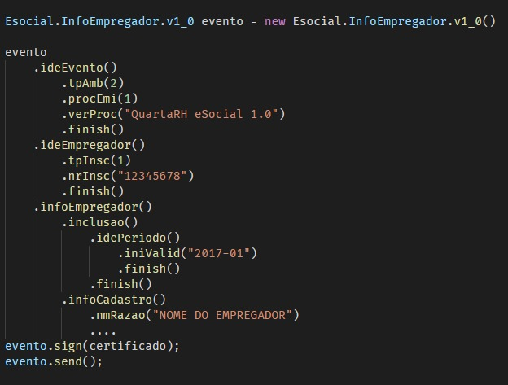

# esocial-client-generator
Com base nos schemas xsd do E-social, gera uma estrutura em Java moderno para consumo dos endpoints de envio/consulta de eventos

Esse programa pode ser usado como uma alternativa ao `wsimport.exe` e ao `wsdl2java` pois foi desenvolvido do zero tendo em mente atender 
especificamente a estrutura de XSDs do E-social, gerando todos os javadocs com documentação campo a campo e uma **interface fluente**, visando a 
facilidade de uso e diminuição de erros no envio de requisições ao E-social.

O objetivo da API gerada será, com unico **new**, e depois usando a interface fluente ser possivel construir um evento completo

Exemplo de código cliente utilizando a API gerada:

Copyright © [Haftware SI](https://haftware.com.br/) e [Elum Digital Think V2](https://www.linkedin.com/company/elum-digital-think/about/)
